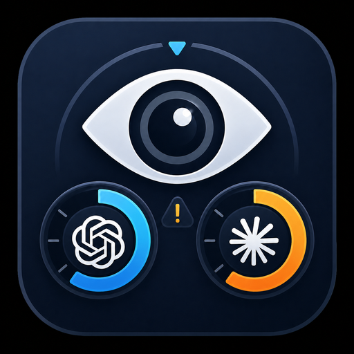

<div align="center">



# TokenWatcher

**A native Windows system-tray app that shows your OpenAI Codex and Claude usage limits at a glance.**

*The Windows alternative to [CodexBar](https://github.com/steipete/CodexBar) — same idea (live OpenAI Codex + Claude rate-limit windows in your menu bar), built from scratch for Windows users who want the same experience without WSL, browser-cookie scraping, or admin tricks.*

[](https://github.com/gehariharan/Tokenwatcher/releases)
[](LICENSE)
[](https://github.com/gehariharan/Tokenwatcher/releases)

</div>

> **CodexBar for Windows** — Inspired by [steipete/CodexBar](https://github.com/steipete/CodexBar) on macOS. This is a Windows-specific Electron implementation, rebuilt from scratch to avoid WSL, browser-cookie scraping, and admin requirements.

---

## What it shows

- **OpenAI Codex** — live 5h / 7d window utilization, plan, account email
- **Claude** — live 5h / 7d / Sonnet / Opus utilization, plan tier, account email

Hover the tray icon, and the panel slides up. No clicks, no extra windows.

## Install (end-users)

1. Download `TokenWatcher-Setup-x.y.z.exe` from the **[Releases page](https://github.com/gehariharan/Tokenwatcher/releases)**
2. Run it. The installer adds TokenWatcher to your Start menu and (optionally) the desktop
3. Pin the tray icon: click the `^` chevron near the clock and **drag the TokenWatcher icon onto the taskbar**

> First-launch SmartScreen note — this app isn't yet code-signed, so Windows will show *"Windows protected your PC"* on first install. Click **More info → Run anyway**.

## Configuration

Click the gear icon ⚙ in the panel header to:
- Toggle **Watch OpenAI Codex** — disable if you don't use Codex
- Toggle **Watch Claude** — disable to skip the Edge sign-in flow entirely

Settings live at `%APPDATA%\TokenWatcher\settings.json`.

## How it works

- **Codex** — reads the OpenAI Codex CLI's OAuth token from `~/.codex/auth.json` and calls the same private endpoint the CLI uses (`chatgpt.com/backend-api/wham/usage`). No additional sign-in needed if you already use the `codex` CLI.
- **Claude** — a one-time sign-in launches Microsoft Edge against `claude.ai/login` with a dedicated user-data-dir. After you sign in, TokenWatcher reads the `sessionKey` cookie via Edge's DevTools Protocol, encrypts it with Windows DPAPI, and stores it locally. Live usage data is then fetched directly from `claude.ai`'s usage API.

| Component | Purpose |
|---|---|
| **Electron** shell | System tray, side-panel BrowserWindow, IPC routing |
| **Pure Node** Codex provider | Reads `~/.codex/auth.json` + HTTPS GET to `chatgpt.com` |
| **Python sidecar** Claude provider | Edge CDP login flow + DPAPI session storage + `curl_cffi` (defeats Cloudflare's TLS fingerprinting) |

### Why a Python sidecar?

`claude.ai` sits behind Cloudflare with TLS / JA3 fingerprinting. Plain Node `fetch` (and Python `requests`) get blocked with *"Just a moment…"*. Python's [`curl_cffi`](https://github.com/yifeikong/curl_cffi) impersonates Chrome's TLS handshake and gets through cleanly. The sidecar is shipped as a single PyInstaller `.exe` inside the installer — users never see Python.

## Privacy & security

- TokenWatcher only ever talks to `chatgpt.com` and `claude.ai`. No third-party servers, no telemetry.
- The Claude sign-in launches Edge with a **dedicated profile directory** (`~/.tokenwatcher/edge-profile/`) — your normal Edge profile is never touched.
- The captured `sessionKey` cookie is encrypted with [Windows DPAPI](https://learn.microsoft.com/en-us/dotnet/standard/security/how-to-use-data-protection) before being written to disk. Only your Windows user account can decrypt it.
- Source code is open and auditable.

## Build from source

### Prerequisites
- Windows 10 / 11
- [Node.js](https://nodejs.org/) 18+
- [Python](https://www.python.org/) 3.10+ (for the Claude sidecar; not needed at runtime — only at build time)
- Microsoft Edge (preinstalled on Windows)

### Setup

```powershell
git clone git@github.com:gehariharan/Tokenwatcher.git
cd Tokenwatcher

# Install Electron + dev deps
npm install

# Set up the Python venv for the sidecar
python -m venv .venv
.\.venv\Scripts\python.exe -m pip install -r sidecar\requirements.txt

# Run in dev mode
npm start
```

In dev mode the app spawns the sidecar via the venv's Python — no need to compile it. To exit, right-click the tray icon → **Quit**.

### Build a Windows installer

```powershell
# Bundle the Python sidecar into resources/claude_fetch.exe
.\build-sidecar.bat

# Build the NSIS installer (output: dist/TokenWatcher Setup x.y.z.exe)
npm run build
```

### Regenerate icons

If you change the source `assets/icon-source.png`, regenerate the multi-resolution outputs:

```powershell
.\.venv\Scripts\python.exe scripts\gen-icons.py
```

### Cut a release

Push a tag — the [GitHub Actions release workflow](.github/workflows/release.yml) builds the sidecar with PyInstaller, builds the NSIS installer, and uploads it to a draft GitHub Release automatically:

```powershell
git tag v0.1.0
git push origin v0.1.0
```

## Project layout

```
TokenWatcher/
├── src/
│   ├── main.js              # Electron main: tray, panel, IPC
│   ├── preload.js           # Context bridge
│   └── renderer/            # Side-panel UI (HTML/CSS/JS)
├── src-node/
│   ├── codex.js             # Pure-Node Codex provider
│   ├── claude.js            # Sidecar invoker
│   └── settings.js          # Settings persistence
├── sidecar/
│   └── claude_fetch.py      # Self-contained: Edge CDP + DPAPI + curl_cffi
├── assets/                  # Icons (PNG / ICO)
├── scripts/
│   └── gen-icons.py         # Regenerate icons from source PNG
└── .github/workflows/
    └── release.yml          # Tag push → installer release
```

## Related projects

- [**steipete/CodexBar**](https://github.com/steipete/CodexBar) — the macOS original
- [**openai/codex**](https://github.com/openai/codex) — the Codex CLI itself
- [**anthropics/claude-code**](https://github.com/anthropics/claude-code) — Claude Code CLI

## Keywords

CodexBar for Windows · CodexBar Windows alternative · Codex usage tracker · Claude usage tracker · OpenAI rate limit monitor · ChatGPT rate limit · Claude rate limit · system tray usage monitor · Windows menu-bar app for Codex · Codex 5h window · Claude 5h window

## License

[MIT](LICENSE)
